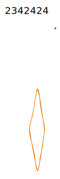

# Inputs


**Good to know:** you can embed a Storybook canvas by simple pasting the canvas link and hitting enter.


## Default


These examples are taken from the excellent [Storybook Example Design System](https://5ccbc373887ca40020446347-geedzbiswp.chromatic.com/iframe.html?id=forms-input--template\&args=).


```javascript
<Styled(Input)
    appearance="pill"
    id="Basic"
    label="label"
    orientation="horizontal"
    value="value"
/>
```

<table data-view="cards"><thead><tr><th></th><th></th><th></th></tr></thead><tbody><tr><td>123131223</td><td>12313</td><td>123132131</td></tr><tr><td></td><td></td><td></td></tr><tr><td></td><td></td><td></td></tr></tbody></table>

<details>

<summary>1231313312</summary>

12313231

</details>



## Stacked


These examples are taken from the excellent [Storybook Example Design System](https://5ccbc373887ca40020446347-geedzbiswp.chromatic.com/?path=/story/forms-input--stacked).

