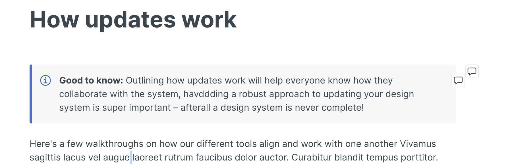

# Hoddw updates work


**Good to know:** Outlining how updates work will help everyone know how they collaborate with the system, havddding a robust approach to updating your design system is super important – afterall a design system is never complete!


Here's a few walkthroughs on how our different tools align and work with one another Vivamus sagittis lacus vel augue laoreet rutrum faucibus dolor auctor. Curabitur blandit tempus porttitor.

<figure><figcaption>
这是个<em>备注</em>
</figcaption></figure>

<figure><figcaption></figcaption></figure>

| 222 | 222 | 222 | eee3333eeeeeeee | 月有232212123131313213ddd123 |
| --- | --- | --- | --------------- | -------------------------- |
| 1   | 2   | 3   | 2222            |                            |
| 4   | 5   | 6   |                 |                            |
|     |     |     |                 |                            |
|     |     |     |                 |                            |

## Example Tool Walkthrough
